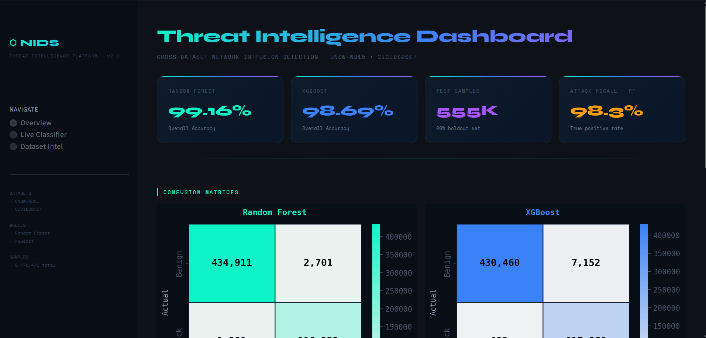
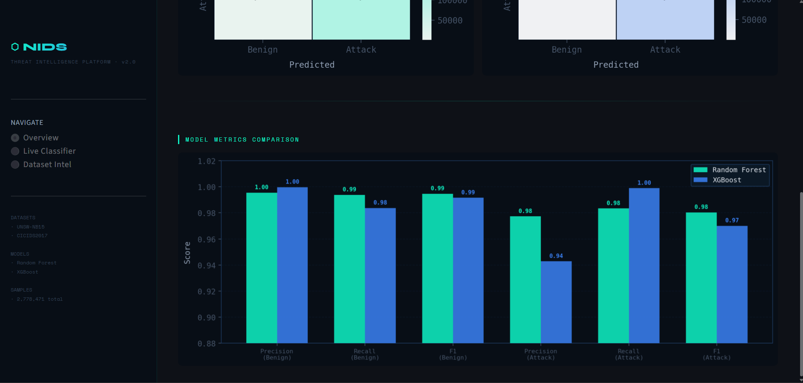
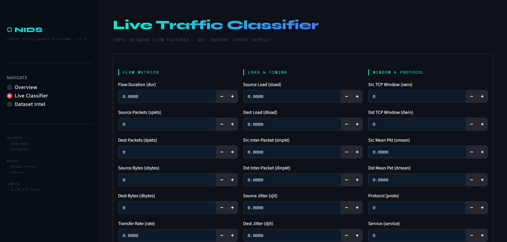
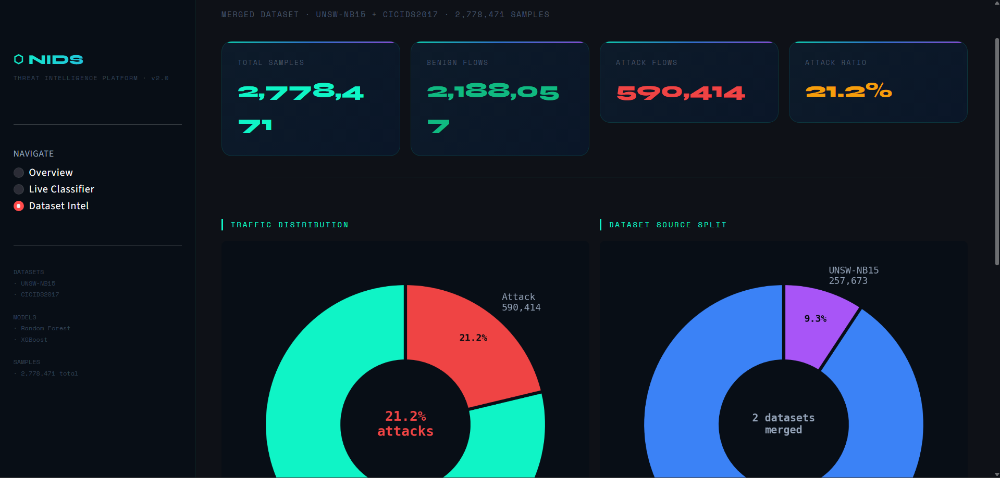

# Cross-Dataset Network Intrusion Detection System

A machine learning-based NIDS that detects malicious network traffic by training across two benchmark datasets — UNSW-NB15 and CICIDS2017 — unified into a Common Feature Schema.

## Results

| Model | Accuracy | Attack Precision | Attack Recall |
|---|---|---|---|
| Random Forest | 99.16% | 98% | 98% |
| XGBoost | 98.69% | 94% | 100% |

Trained and evaluated on a merged dataset of 2,778,471 samples.

## Features
- Cross-dataset preprocessing pipeline (UNSW-NB15 + CICIDS2017)
- Common Feature Schema for unified training
- Binary classification — Benign vs Attack
- Interactive Streamlit dashboard with live risk scoring

## Setup

### 1. Install dependencies
pip install -r requirements.txt

### 2. Download datasets
- CICIDS2017: https://www.unb.ca/cic/datasets/ids-2017.html
- UNSW-NB15: https://www.kaggle.com/datasets/dhoogla/unswnb15
- Place all files in the data/ folder

### 3. Run preprocessing
python preprocessing/clean_unsw.py
python preprocessing/clean_cicids.py
python preprocessing/merge.py

### 4. Train models
python models/train.py

### 5. Launch dashboard
python -m streamlit run dashboard/app.py

---> Dashboard Screenshots:

## Team
Built as a coursework project at M S Ramaiah Institute of Technology, Bengaluru.
